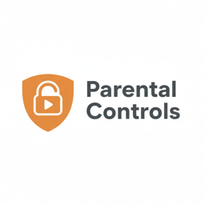

<p align="center">
  
</p>

# Home Assistant Parental Controls

A HACS-installable custom integration that monitors media playback across your Home Assistant devices and enforces content and time restrictions.

## Features

- **Multi-device monitoring** — Track any `media_player` entity (AppleTV, Amazon Echo, Chromecast, etc.)
- **9-layer content filter pipeline** — Local checks first (zero API tokens), OpenAI only as a last resort
- **Strike system** — After configurable violations, the device locks out until a parent manually unlocks it
- **App blocklist/allowlist** — Block or always-allow specific apps by name
- **Keyword filtering** — Block content with specific words in the title or artist
- **Title pattern analysis** — Regex-based detection of profanity, suggestive content, drug references, and troll/meme content with configurable strictness (Relaxed/Moderate/Strict)
- **Time limits** — Per-app, total, video, and audio daily usage limits with automatic midnight reset
- **Aggregate or per-device enforcement** — Enforce time limits per device or across all monitored devices as a household total
- **Schedule enforcement** — Block playback outside allowed hours
- **Parent mode** — Per-device toggle to bypass all filtering and usage tracking when a parent is using the device
- **Schedule-based tracking** — Option to only accumulate usage during configured allowed hours (parent viewing outside those hours is automatically ignored)
- **OpenAI content analysis** — Optional AI classification of song/video names via the HA Conversation integration
- **Result caching** — OpenAI results are cached to avoid re-analyzing the same content
- **TTS announcements** — Announce blocks on supported devices (e.g., Amazon Echo)
- **Persistent notifications** — Alert parents when content is blocked
- **Dashboard-friendly** — All settings exposed as HA entities (switches, numbers, selects) for Lovelace cards

## Installation

### HACS (Recommended)

1. Open HACS in your Home Assistant instance
2. Click the three dots menu > **Custom repositories**
3. Add this repository URL and select **Integration** as the category
4. Click **Install**
5. Restart Home Assistant

### Manual

1. Copy the `custom_components/parental_controls/` directory to your HA config's `custom_components/` folder
2. Restart Home Assistant

## Setup

1. Go to **Settings > Devices & Services > Add Integration**
2. Search for **Parental Controls**
3. Follow the config flow:
   - **Step 1**: Select media player devices to monitor
   - **Step 2**: Configure blocked/allowed apps, keywords, content ratings, and filter strictness
   - **Step 3**: Set time limits, media usage schedule, tracking options, and max strikes before lockout
   - **Step 4**: Configure TTS blocking announcements
   - **Step 5**: Enable/disable OpenAI content analysis

All settings can be changed later via **Settings > Devices & Services > Parental Controls > Configure**.

## Filter Pipeline

Content is checked through 9 layers. Layers 1-8 use zero API tokens:

| Layer | Check | Tokens | Result |
|-------|-------|--------|--------|
| 1 | Outside allowed hours? | 0 | Block |
| 2 | Device locked (strikes exceeded)? | 0 | Block |
| 3 | App on blocklist? | 0 | Block + strike |
| 4 | App on allowlist? | 0 | Allow (skip rest) |
| 5 | Keyword in title/artist? | 0 | Block + strike |
| 6 | Inappropriate title pattern? | 0 | Block + strike |
| 7 | Previously analyzed (cached)? | 0 | Use cached result |
| 8 | Time limit exceeded? | 0 | Block (no strike) |
| 9 | OpenAI analysis (if enabled) | ~150 | Block + strike or cache as safe |

> **Note:** The "Max content rating" and "Music rating policy" settings are evaluated in Layer 9 only. They are passed as context to the AI model — there is no local rating lookup. If AI content analysis is disabled, these two settings have no effect.

## Strike System

Content violations increment a per-device strike counter:

- **Strikes add**: Blocked apps (L3), blocked keywords (L5), bad title patterns (L6), AI flags (L9)
- **No strike**: Schedule blocks (L1), time limits (L8) — these aren't the child's fault
- **Lockout**: When strikes reach the max, ALL playback is blocked until a parent unlocks
- **Unlock**: Use the unlock switch entity or call `parental_controls.unlock_device`
- **Persistence**: Strikes survive HA restarts

## Usage Limit Mode

Time limits can be enforced in two modes, controlled by the **Usage limit mode** select entity:

- **per_device** (default) — Each device has its own independent usage counters. A 120-minute limit means each device gets 120 minutes.
- **aggregate** — Usage is summed across all monitored devices. A 120-minute limit means 120 minutes total across the household.

This applies to all time-based limits: tracked apps, total media, video, and audio.

## Media Type Tracking

Usage is automatically classified as **video** or **audio**:

- **Audio**: Media with an artist name and no episode pattern (e.g., music on Spotify)
- **Video**: Everything else — TV shows, movies, live TV, clips, and unknown content

This classification uses the same episode-detection heuristics as the caching system. Separate daily limits can be set for video and audio (0 = unlimited).

## Entities Created

For each monitored device (e.g., `living_room_tv`):

| Entity | Type | Description |
|--------|------|-------------|
| `switch.parental_controls_living_room_tv_parental_controls` | Switch | Enable/disable monitoring |
| `switch.parental_controls_living_room_tv_unlock` | Switch | Turn OFF to unlock device |
| `switch.parental_controls_living_room_tv_parent_mode` | Switch | Parent mode — bypass all monitoring |
| `sensor.parental_controls_living_room_tv_strikes` | Sensor | Current strike count |
| `sensor.parental_controls_living_room_tv_usage_today` | Sensor | Total usage today (min) |
| `sensor.parental_controls_living_room_tv_tracked_apps_usage_today` | Sensor | Tracked apps usage today (min) |
| `binary_sensor.parental_controls_living_room_tv_locked` | Binary Sensor | Locked status |

Global entities:

| Entity | Type | Description |
|--------|------|-------------|
| `switch.parental_controls_master` | Switch | **Global ON/OFF** — disables ALL monitoring when OFF |
| `sensor.parental_controls_last_blocked` | Sensor | Last blocked content info |
| `sensor.parental_controls_aggregate_usage_today` | Sensor | Total usage across all devices (min) |
| `sensor.parental_controls_aggregate_video_usage_today` | Sensor | Video usage across all devices (min) |
| `sensor.parental_controls_aggregate_audio_usage_today` | Sensor | Audio usage across all devices (min) |
| `sensor.parental_controls_aggregate_tracked_apps_usage_today` | Sensor | Tracked apps usage across all devices (min) |
| `number.parental_controls_tracked_apps_limit` | Number | Tracked apps daily limit (min) |
| `number.parental_controls_media_usage_limit` | Number | Total media usage limit (min) |
| `number.parental_controls_video_daily_limit` | Number | Video daily limit (min, 0 = unlimited) |
| `number.parental_controls_audio_daily_limit` | Number | Audio daily limit (min, 0 = unlimited) |
| `number.parental_controls_max_strikes` | Number | Strikes before lockout |
| `select.parental_controls_content_rating` | Select | Max content rating (G/PG/PG-13/R) — requires AI analysis |
| `select.parental_controls_music_rating` | Select | Music rating policy — requires AI analysis |
| `select.parental_controls_filter_strictness` | Select | Title filter strictness |
| `select.parental_controls_usage_limit_mode` | Select | Usage limit mode (per_device / aggregate) |

## Services

| Service | Description |
|---------|-------------|
| `parental_controls.unlock_device` | Reset strikes for a specific device |
| `parental_controls.unlock_all` | Reset all strikes across all devices |
| `parental_controls.clear_cache` | Clear cached OpenAI analysis results |
| `parental_controls.add_blocked_app` | Add an app to the blocklist |
| `parental_controls.remove_blocked_app` | Remove an app from the blocklist |
| `parental_controls.set_parent_mode` | Enable/disable parent mode for a device |

## Dashboard Example

```yaml
type: entities
title: Parental Controls
entities:
  - entity: switch.parental_controls_master
  - type: divider
  - entity: switch.parental_controls_apple_tv_living_room_parental_controls
  - entity: sensor.parental_controls_apple_tv_living_room_strikes
  - entity: binary_sensor.parental_controls_apple_tv_living_room_locked
  - entity: switch.parental_controls_apple_tv_living_room_unlock
  - entity: switch.parental_controls_apple_tv_living_room_parent_mode
  - entity: sensor.parental_controls_apple_tv_living_room_usage_today
  - entity: sensor.parental_controls_apple_tv_living_room_tracked_apps_usage_today
  - type: divider
  - entity: number.parental_controls_tracked_apps_limit
  - entity: number.parental_controls_media_usage_limit
  - entity: number.parental_controls_video_daily_limit
  - entity: number.parental_controls_audio_daily_limit
  - entity: number.parental_controls_max_strikes
  - entity: select.parental_controls_content_rating
  - entity: select.parental_controls_music_rating
  - entity: select.parental_controls_filter_strictness
  - entity: select.parental_controls_usage_limit_mode
  - type: divider
  - entity: sensor.parental_controls_aggregate_usage_today
  - entity: sensor.parental_controls_aggregate_video_usage_today
  - entity: sensor.parental_controls_aggregate_audio_usage_today
  - entity: sensor.parental_controls_aggregate_tracked_apps_usage_today
  - entity: sensor.parental_controls_last_blocked
```

## Blocking Behavior

When content is blocked:
1. **Pause** — Immediate `media_player.media_pause`
2. **Stop** — Full `media_player.media_stop`
3. **TTS** (if enabled) — Spoken announcement on the device (e.g., "This content has been blocked")
4. **Notification** — Persistent notification with content name, reason, and strike count

When a device is **locked** (max strikes reached):
- TTS changes to: "This device is locked. Ask a parent to unlock it."
- Repeat-block cooldown prevents the "keep pressing play" workaround
- Parent notification includes unlock instructions

**Note**: There is an inherent ~0.5-2 second delay between content starting to play and HA reacting. HA cannot intercept playback before it begins.

## OpenAI Token Usage

With the layered pipeline, OpenAI is only called when:
- The app is not on a blocklist or allowlist
- No blocked keywords or patterns match the title
- The content hasn't been analyzed before (cache miss)
- OpenAI analysis is explicitly enabled

Each call uses ~150 input tokens and 1 output token. Results are cached to prevent re-analysis.

## License

MIT License. See [LICENSE](LICENSE) for details.
